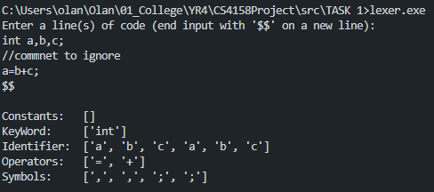

Design and implement a lexical analyzer in C that processes a given line of code by tokenizing it while ignoring redundant spaces, tabs, and newlines. The analyzer recognises the following token types:

- **Keywords:** Recognizes reserved words such as int, String, and long.
- **Identifiers:** Matches sequences that start with a letter or underscore, followed by letters, digits, or underscores.
- **Numbers:** Recognizes sequences of digits.
- **Operators:** Recognizes basic operators such as +, -, *, /, and =.
- **Punctuators:** Matches punctuation symbols like commas, semicolons, and periods.
- **Symbols:** Any character not matching the above rules is printed as a symbol.

