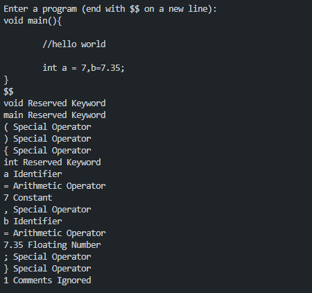

# Task 2: Implementation of Lexical Analyser using Lex Tool
In this task, a simple lexical analyser is implemented using Lex ( same as last just in lex). This analyser reads an input stream and tokenises it according to the following rules:

- **Keywords:** Recognizes reserved words such as int, String, and long.
- **Identifiers:** Matches sequences that start with a letter or underscore, followed by letters, digits, or underscores.
- **Numbers:** Recognizes sequences of digits.
- **Operators:** Recognizes basic operators such as +, -, *, /, and =.
- **Punctuators:** Matches punctuation symbols like commas, semicolons, and periods.
- **Symbols:** Any character not matching the above rules is printed as a symbol.

